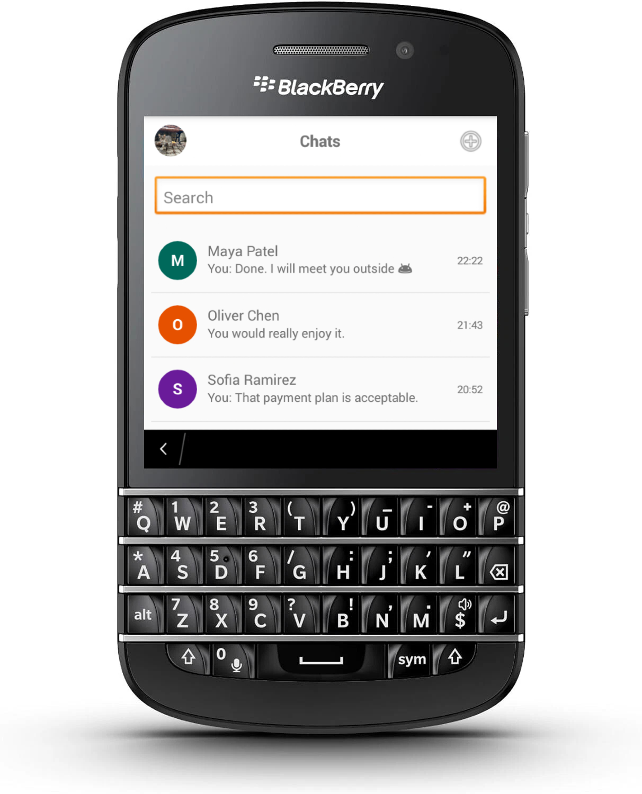
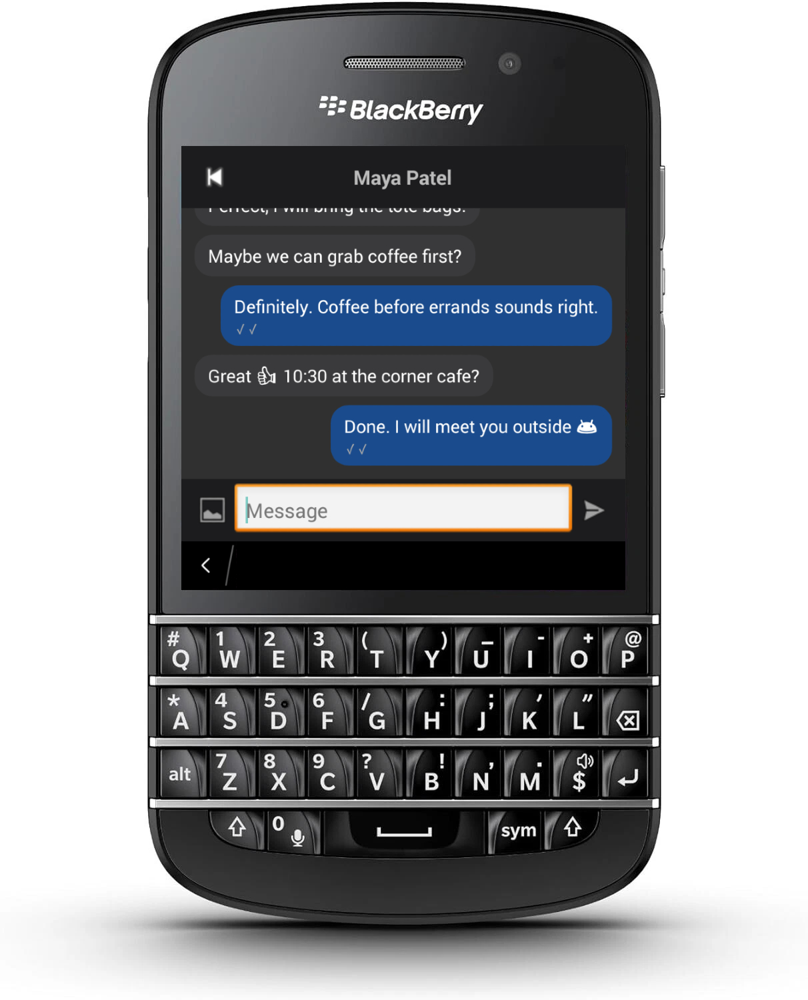

# SignalBerry

A Signal messenger client for BlackBerry Android devices.

<p align="center">
  
  &nbsp;&nbsp;
  
</p>

Built on top of [signal-cli](https://github.com/AsamK/signal-cli) via the [signal-cli-rest-api](https://github.com/bbernhard/signal-cli-rest-api) Docker image, with a companion [SignalBerry Bridge](https://github.com/cengizozel/SignalBerryBridge) for offline message persistence.

## Architecture

```
Signal Network
     │
     ▼
signal-cli-rest-api  (Docker, port 5000)
     │  WebSocket /v1/receive
     ▼
SignalBerry Bridge   (Docker, port 9099)
     │  SQLite — persists messages offline
     ▼
SignalBerry Android  (HTTP polling + WebSocket)
```

The Android app connects directly to signal-cli-rest-api for real-time messages (WebSocket) and sending. The bridge runs alongside it and stores every message to SQLite so the app can catch up on messages received while it was closed.

## Features

- **Realtime messaging** — WebSocket receive + send; bridge polling catches up missed messages
- **Message status** — 🕒 pending → ✓ sent → ✓✓ delivered → ✓✓ read
- **Replies** — long-press a message to quote-reply
- **Emoji reactions** — react to messages; syncs across devices
- **Images** — send from gallery, receive and view full-screen
- **Light / dark mode** — toggle in Settings
- **Conversation list** — snippet, timestamp, and unread badge per contact
- **Search** — filter contacts in the message list

## Setup

You need two Docker containers running on a machine reachable from your Android device. The easiest way is to use the [SignalBerry Bridge](https://github.com/cengizozel/SignalBerryBridge) repo, which ships a `docker-compose.yml` that starts both.

### 1. Clone the bridge repo

```bash
git clone https://github.com/cengizozel/SignalBerryBridge
cd SignalBerryBridge
```

### 2. Set your Signal number

Create a `.env` file in the bridge directory:

```
SIGNAL_NUMBER=+12223334444
```

### 3. Start the stack

```bash
docker compose up -d --build
```

This starts:
- `signal-api` — signal-cli-rest-api on port `5000`
- `signal-bridge` — SignalBerry Bridge on port `9099`

### 4. Link your Signal account

Open this URL in a browser on the Docker host:

```
http://YOUR_HOST:5000/v1/qrcodelink?device_name=signal-api
```

On your phone: **Signal → Settings → Linked Devices → "+" → scan the QR code.**

Verify it worked:

```bash
curl http://YOUR_HOST:5000/v1/accounts
```

### 5. Connect the Android app

1. Open SignalBerry on your device.
2. Enter `YOUR_HOST:5000` as the **API Host** and your Signal number in E.164 format.
3. Tap **Connect** — your contacts will load and you can start chatting.

## Notes

- The device running Docker and the Android device must be on the same network (or the Docker ports must be reachable).
- No TLS or authentication — intended for local / trusted network use only.
- No background notifications; the app must be open to receive messages in real time. Messages received while closed are delivered via bridge polling on next open.
- Groups, voice/video, disappearing messages, and stickers are not supported.
